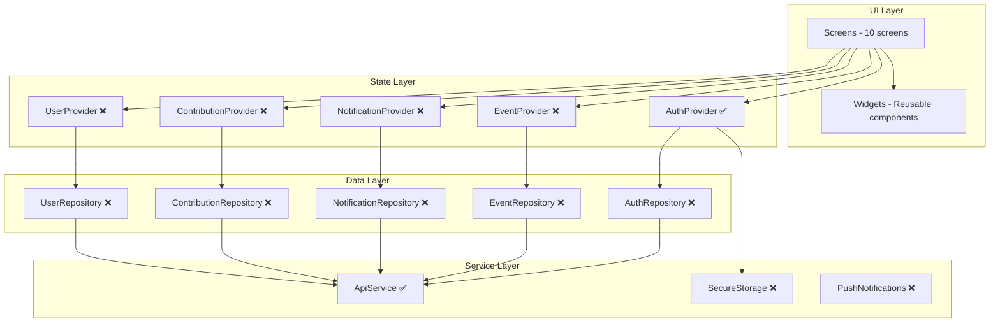

# FaithConnect — Completeness Analysis & Gap Assessment

## What FaithConnect Should Do

Based on the Stitch UI designs and the project name, **FaithConnect** is a **community management platform for religious congregations** (churches, mosques, temples, etc.). It should enable:

1. **Member Authentication** — Secure login/registration for community members
2. **Home Dashboard** — Personalized overview of community activity
3. **Event Management** — Browse, view details, and register for community events
4. **Contributions/Giving** — Track donations, tithes, offerings with receipt downloads
5. **Notifications** — Real-time alerts for urgent changes, events, and community info
6. **Profile & Settings** — Manage personal info, preferences, and security

---

## Current Status: What's Done ✅

### UI Layer (100% of Stitch designs implemented)
| Screen | File | Status |
|--------|------|--------|
| Welcome/Onboarding | `onboarding_screen.dart` | ✅ Complete |
| Login | `login_screen.dart` | ✅ Complete |
| Registration | `register_screen.dart` | ✅ Complete |
| Home Dashboard | `home_screen.dart` | ✅ Complete |
| Events List | `events_list_screen.dart` | ✅ Complete |
| Event Details | `event_details_screen.dart` | ✅ Complete |
| Notifications | `notifications_screen.dart` | ✅ Complete |
| Contributions | `contributions_screen.dart` | ✅ Complete |
| Profile | `profile_screen.dart` | ✅ Complete |
| Settings | `settings_screen.dart` | ✅ Complete |

### Architecture Layer
| Component | Status |
|-----------|--------|
| Color system | ✅ Complete |
| Theme (Material 3) | ✅ Complete |
| Route management | ✅ Complete |
| Data models (User, Event, Notification, Contribution) | ✅ Complete |
| API service (HTTP client with auth) | ✅ Complete |
| Auth state management (Provider) | ✅ Complete |
| Bottom navigation shell | ✅ Complete |
| Reusable widgets | ✅ Complete |

---

## What's Missing: Gaps to Fill 🔴

### 1. CRITICAL — State Management for All Features
Currently only `AuthProvider` exists. The app needs:

- [ ] **EventProvider** — Fetch events from API, manage event state, handle event registration
- [ ] **NotificationProvider** — Fetch notifications, mark as read, real-time updates
- [ ] **ContributionProvider** — Fetch contribution history, create new contributions
- [ ] **UserProvider** — Manage user profile updates, avatar upload

### 2. CRITICAL — Repository Layer
No repository pattern exists. Each feature needs a repository to abstract data access:

- [ ] **AuthRepository** — `login()`, `register()`, `forgotPassword()`, `refreshToken()`
- [ ] **EventRepository** — `getEvents()`, `getEventById()`, `registerForEvent()`, `cancelRegistration()`
- [ ] **NotificationRepository** — `getNotifications()`, `markAsRead()`, `markAllAsRead()`
- [ ] **ContributionRepository** — `getContributions()`, `createContribution()`, `downloadReceipt()`
- [ ] **UserRepository** — `getProfile()`, `updateProfile()`, `changePassword()`, `uploadAvatar()`

### 3. CRITICAL — Missing Functional Screens
These screens are referenced in the UI but don't exist:

- [ ] **Forgot Password Screen** — Referenced from login screen
- [ ] **Edit Profile Screen** — Referenced from profile screen
- [ ] **New Contribution Screen** — FAB on contributions screen
- [ ] **Search Screen** — Search icon on home and events screens
- [ ] **Language Selection Dialog/Screen** — Referenced from settings
- [ ] **Appearance Selection Dialog/Screen** — Referenced from settings
- [ ] **Change Password Screen** — Referenced from settings
- [ ] **Privacy/Confidentiality Screen** — Referenced from settings

### 4. HIGH — Form Validation & Error Handling
- [ ] **Email validation** — Proper regex validation for email format
- [ ] **Phone validation** — International phone format validation
- [ ] **Password strength indicator** — Visual feedback on password strength
- [ ] **Network error handling** — Offline state, retry mechanisms, error screens
- [ ] **Loading states** — Skeleton screens or shimmer effects while loading
- [ ] **Empty states** — UI for when lists are empty (no events, no notifications, etc.)

### 5. HIGH — Token Management & Session
- [ ] **Secure token storage** — Use `flutter_secure_storage` instead of `SharedPreferences` for auth tokens
- [ ] **Token refresh** — Auto-refresh expired JWT tokens
- [ ] **Session expiry** — Auto-logout when session expires
- [ ] **Auth guard** — Route protection to prevent unauthenticated access to protected screens

### 6. HIGH — Real Data Integration Points
All screens currently use mock/hardcoded data. Each needs to be wired to the API:

- [ ] Home dashboard — Fetch user greeting, next event, contribution summary, recent notifications
- [ ] Events list — Fetch paginated events with category filtering
- [ ] Event details — Fetch single event, handle registration API call
- [ ] Notifications — Fetch paginated notifications, WebSocket for real-time
- [ ] Contributions — Fetch paginated history, handle receipt download
- [ ] Profile — Fetch user profile from API

### 7. MEDIUM — Missing UI Features from Designs
- [ ] **Pull-to-refresh** on all list screens
- [ ] **Pagination** (infinite scroll) for events, notifications, contributions
- [ ] **Image loading** — Network images with caching (use `cached_network_image`)
- [ ] **Animations** — Page transitions, list item animations
- [ ] **Dark mode** — Theme switching (settings references "Apparence: Système")
- [ ] **Localization** — French/English switching (settings references "Langue: Français")

### 8. MEDIUM — Missing Dependencies
The `pubspec.yaml` needs additional packages:

- [ ] `flutter_secure_storage` — Secure token storage
- [ ] `cached_network_image` — Image caching
- [ ] `shimmer` — Loading skeleton effects
- [ ] `url_launcher` — Open maps, phone, email
- [ ] `image_picker` — Avatar upload
- [ ] `flutter_local_notifications` — Push notification handling
- [ ] `firebase_messaging` (or alternative) — Push notification service
- [ ] `connectivity_plus` — Network state monitoring

### 9. LOW — Testing
- [ ] Unit tests for models (`fromJson`/`toJson`)
- [ ] Unit tests for providers
- [ ] Unit tests for API service
- [ ] Widget tests for each screen
- [ ] Integration tests for auth flow
- [ ] Integration tests for navigation

### 10. LOW — Production Readiness
- [ ] **App icon** — Custom launcher icon (currently default Flutter icon)
- [ ] **Splash screen** — Native splash screen
- [ ] **Deep linking** — Handle notification taps, shared event links
- [ ] **Analytics** — Track screen views, user actions
- [ ] **Crash reporting** — Sentry or Firebase Crashlytics
- [ ] **CI/CD** — Build and deploy pipeline
- [ ] **Environment config** — Dev/staging/production API URLs

---

## Architecture Diagram

---

## Recommended Implementation Order

### Phase 1 — Make it Functional
1. Add missing providers (Event, Notification, Contribution, User)
2. Add repository layer for all features
3. Implement auth guard and token management
4. Add forgot password, edit profile, new contribution screens
5. Wire all screens to providers (replace mock data)

### Phase 2 — Polish the UX
6. Add loading states (shimmer/skeleton)
7. Add empty states for all lists
8. Add pull-to-refresh and pagination
9. Add form validation with visual feedback
10. Add network error handling and offline state

### Phase 3 — Production Ready
11. Add image loading with caching
12. Implement dark mode and localization
13. Add push notifications
14. Add app icon and splash screen
15. Add analytics and crash reporting
16. Write tests
17. Set up CI/CD

---

## Summary

| Category | Completion |
|----------|-----------|
| **UI Screens** | ✅ 100% (10/10 screens) |
| **Core Architecture** | ✅ 70% (models, API, auth provider done) |
| **State Management** | 🟡 20% (only auth, need 4 more providers) |
| **Repository Layer** | 🔴 0% (none exist) |
| **Backend Integration** | 🔴 0% (all mock data) |
| **Missing Screens** | 🔴 0% (8 secondary screens missing) |
| **Error/Loading States** | 🔴 0% |
| **Testing** | 🔴 0% |
| **Production Readiness** | 🔴 0% |
| **Overall** | **~35% complete** |

The app has a solid UI foundation matching all Stitch designs, but needs significant work on the data layer, state management, and secondary screens before it can be connected to a real backend and deployed to production.
